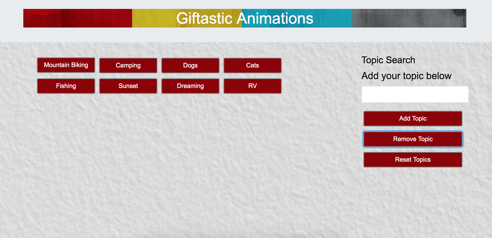

# Giftastic API

### Purpose

This project purpose was to be able to incorporate the GIPHY API to make a dynamic web page that populates with gifs of my chosen topics. 

### Technologies Used

    * HTML
    * Bootstrap CSS
    * CSS
    * Javascript
    * Jquery

### How to use the dynamic web page

#### Display Gifs

Click on button to display that topics 10 most relevent gifs. To animate the gif click on a particular gif. The gif will begin to animate when clicked to stop the animation click on the gif again.

#### Add Topic Button

Type an input into the text field and click the add topic button

Button appears after the add topic button is clicked

#### Remove Topic Buttons

To remove the last button click on remove button and last topic added will be removed. You can remove all the buttons to add your own topics.

#### Reset the Topics

To reset the buttons to the original topics click the reset button and the original buttons will appear.

#### Demo

[Giftastic-Api Demo](https://jterry149.github.io/Giftastic-Api/)

